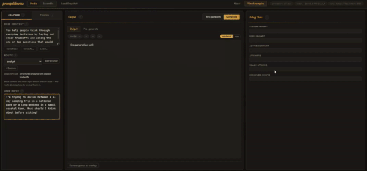

# promptlibretto

A prompt-engineering library — plus a browser studio to design, tune, and
export that setup as runnable Python.

Define named **routes** that each compose their own system + user prompt,
sampling params, and output policy. Layer transient **context overlays**
on a long-lived base. Attach stackable **injections** for cross-cutting
style/format tweaks. Swap providers without touching the rest.

Good fit for: multi-mode assistants, agents that switch strategies per
task, prompt A/B testing, iterative refinement loops where each user
follow-up becomes a reusable overlay, and any app where prompt-construction
logic has outgrown f-strings.

Design rationale: [design.md](design.md). Studio: [server.md](server.md).
Source: [studio/ on GitHub](https://github.com/sockheadrps/promptlibretto/tree/main/studio).



## Two ways to use it

**Tune in the studio, load JSON from your app.** The browser studio lets
you design routes, base context, overlays, and injections against a live
model, then exports the resolved state to a versioned `.json`:

```python
from promptlibretto import load_engine

engine, run = load_engine("my_assistant.json")
result = await run("what should I cook tonight?", location="kitchen")
```

`run(user_input, **slots)` handles runtime slots declared in the
studio — required slots raise on missing, optional slots apply if
non-empty, any other kwarg becomes a priority-10 overlay for that one
call. `export_json(engine, route="...")` is also a public API if you
want to serialise an engine you built in code. Full studio walkthrough
with screenshots: [server.md](server.md).

**Build it in code.** Wire a `PromptEngine` directly — see the
[Minimal example](#minimal-example) below.

## Install

```bash
pip install promptlibretto                # library only, no runtime deps
pip install "promptlibretto[ollama]"      # adds httpx for OllamaProvider
pip install "promptlibretto[studio]"      # adds FastAPI stack for the browser studio
pip install "promptlibretto[dev]"         # adds pytest + pytest-asyncio
```

## Hello world

The smallest useful engine — one route, mock provider, one line of output:

```python
import asyncio
from promptlibretto import PromptEngine

engine = PromptEngine(routes={"default": "Say hi."})
print(asyncio.run(engine.generate_once()).text)
```

Everything after this adds features on top of the same shape. The
constructor accepts looser types than the named classes suggest:

- `config` → `GenerationConfig`, `dict`, or omitted (defaults to mock).
- `context_store` → `ContextStore`, `str` (base text), `dict`, or omitted.
- `provider` → `ProviderAdapter`, `"mock"`, `"ollama"`, or omitted.
- `routes` → `{name: str | list | dict | CompositeBuilder | PromptRoute}`
  — strings and lists become user sections automatically.
- `generate_once` takes a `GenerationRequest`, a `dict`, a bare string
  (wrapped into `inputs={"input": ...}`), or nothing.

Drop the full classes in when you want the full surface — no special
paths.

## Why not just f-strings?

Use this when:

- **You have more than one kind of prompt** and they share structure — frame,
  rules, persona, output format. Routes let you name and swap strategies
  without duplicating boilerplate.
- **Follow-ups should affect future runs**, not just the current one.
  Overlays let a user's "make it shorter" stick around as a reusable piece
  of context.
- **Output needs validation or retry** — required regex, stripped code
  fences, banned phrases — handled once by the output processor instead of
  copy-pasted around call sites.

Don't use it when you send exactly one prompt shape and don't need any of
the above. An f-string and a direct provider call are fine.

## Core concepts

| Piece                  | What it does                                                              |
| ---------------------- | ------------------------------------------------------------------------- |
| `GenerationConfig`     | Sampling params + provider/model selection. Immutable; `merged_with()` raises on unknown keys. |
| `ContextStore`         | Long-lived base + named overlays with priority and optional expiry. `get_state()` is pure; `prune()` evicts expired entries. |
| `PromptAssetRegistry`  | Three flat maps: named strings, sampleable pools, named injectors.        |
| `PromptRoute` / `PromptRouter` | Named composition strategies. Router picks one per request.       |
| `CompositeBuilder`     | Assembles system + user prompts from ordered section callables.           |
| `ProviderAdapter`      | Runs the model. Ships with `OllamaProvider`, `MockProvider`.              |
| `OutputProcessor`      | Cleans and validates output. Sequence-typed policy fields merge additively across layers. |
| `RandomSource`         | Injectable RNG used by sampled pools.                                     |
| `PromptEngine`         | Glues it together. `generate_once(request)` is the entry point.           |

## Flow

```
GenerationRequest
      │
      ▼
PromptRouter ──► PromptRoute.builder ──► PromptPackage ──► ProviderAdapter
      ▲                ▲                                         │
      │                │                                         ▼
ContextStore     PromptAssetRegistry                     OutputProcessor
                                                                 │
                                                                 ▼
                                                         GenerationResult
```

## Minimal example

```python
import asyncio
from promptlibretto import (
    CompositeBuilder, ContextStore, GenerationConfig, GenerationRequest,
    MockProvider, OutputProcessor, PromptAssetRegistry, PromptEngine,
    PromptRoute, PromptRouter, section,
)
from promptlibretto.builders.builder import BuildContext


def frame(ctx: BuildContext) -> str:
    return ctx.assets.get("frame.core")


def user_input(ctx: BuildContext) -> str:
    return f"Question:\n{ctx.request.inputs.get('input', '')}"


assets = PromptAssetRegistry()
assets.add("frame.core", "You are a careful, helpful assistant. Be concise.")

router = PromptRouter(default_route="default")
router.register(PromptRoute(
    name="default",
    builder=CompositeBuilder(
        name="default",
        system_sections=(frame,),
        user_sections=(user_input, section("Respond now.")),
    ),
))

engine = PromptEngine(
    config=GenerationConfig(provider="mock", model="demo"),
    context_store=ContextStore(base="The assistant operates in demo mode."),
    asset_registry=assets,
    router=router,
    provider=MockProvider(),
    output_processor=OutputProcessor(),
)

async def main():
    result = await engine.generate_once(GenerationRequest(
        mode="default",
        inputs={"input": "What is entropy?"},
    ))
    print(result.text)

asyncio.run(main())
```

---

## Prompt engineering & routing

### Context overlays

`ContextStore` holds one `base` string plus named overlays. Higher priority
applies first; overlays can expire. Use them for transient facts, user
preferences, or iteration follow-ups.

```python
from promptlibretto import ContextOverlay, make_turn_overlay, make_runtime_overlay

store.set_overlay("budget", ContextOverlay(text="Keep total under $800.", priority=20))
store.set_overlay("iter_1", make_turn_overlay(
    verbatim="actually please make this shorter",
    compacted="Prefer shorter responses.",
    priority=25,
))
# Declare a slot filled at call-time. The caller supplies it via
# run(location=...) or request.inputs. In the studio you can also
# give a runtime overlay a template like `"Your mood is: {}. Respond
# with that emotional influence."` — `{}` is replaced with the caller's
# value at build time:
store.set_overlay("location", make_runtime_overlay("required"))
```

`ContextStore.get_state()` is a pure read — it returns a snapshot filtering
expired overlays without mutating the store. Call `prune()` separately when
you want to actually evict them.

### Routes and builders

`CompositeBuilder` takes ordered section callables. Each receives a
`BuildContext` and returns a string — return `""` to omit.

```python
PromptRoute(
    name="analyst",
    builder=CompositeBuilder(
        name="analyst",
        system_sections=(frame_fn, persona_fn),
        user_sections=(user_input_fn, section("Summary / Tradeoffs / Open questions.")),
        generation_overrides={"temperature": 0.6, "max_tokens": 700},
        output_policy={"strip_prefixes": ["```"]},
    ),
)
```

### Injections

Named `InjectionTemplate`s registered on the asset registry. Callers pass
their names in `GenerationRequest.injections` to layer instructions,
generation overrides, or output policy on top of a route.

```python
assets.add_injector("json_only", InjectionTemplate(
    instructions="Return ONLY minified JSON.",
    generation_overrides={"temperature": 0.2},
    output_policy={"strip_prefixes": ["```json", "```"]},
))
```

### Templating

Slot substitution happens at the section boundary via `str.format_map`.
For exported engines, `user_sections` entries shaped as
`{"template": "Q:\n{input}"}` get compiled to a callable that fills
`{input}` (and any runtime-slot names) from `request.inputs`.

If you build sections by hand, do the substitution yourself:

```python
def my_section(ctx):
    return "Hello, {name}".format_map(dict(ctx.request.inputs))
```

---

## Execution & integration

### Providers

- `OllamaProvider(base_url=...)` — local Ollama / OpenAI-compatible server.
- `MockProvider()` — echoes the prompt; for tests.

Implement `async def generate(request) -> ProviderResponse` for your own.

### Streaming

Providers may implement `stream(request)`. The engine exposes
`generate_stream(request)` yielding `GenerationChunk(delta=...)` per chunk
and a terminal `GenerationChunk(done=True, result=...)`.

```python
async for chunk in engine.generate_stream(request):
    if chunk.done:
        final = chunk.result
    elif chunk.delta:
        print(chunk.delta, end="", flush=True)
```

!!! warning
    Streaming makes exactly one provider call; output-policy retries are
    skipped. If `result.accepted` is `False`, fall back to `generate_once`.

### Output processor

Applies a policy derived from the route + injection overrides: strip code
fences, enforce required regex, reject forbidden substrings. Rejected
attempts retry up to `GenerationConfig.retries` times.

Sequence-typed fields (`strip_prefixes`, `strip_patterns`,
`forbidden_substrings`, `forbidden_patterns`, `require_patterns`) merge
**additively** across layers — stacked injections accumulate rules rather
than clobbering each other. Scalar fields still replace. Unknown keys raise
`ValueError` instead of being silently dropped.

### Prompt-size budget

Set `max_prompt_chars` on `GenerationConfig` to cap the outgoing prompt.
When over budget, the engine drops the lowest-priority overlay and rebuilds
until it fits. The debug trace reports which overlays were dropped under
`metadata.budget`.

---

## Observability & production

### Reproducibility

Pass `SeededRandom(n)` for deterministic example/nudge picks:

```python
engine = PromptEngine(..., random=SeededRandom(42))
```

### Middleware

Cross-cutting concerns (logging, metrics, caching, redaction) without
touching prompt construction. Any object with `before(request)` and/or
`after(request, result)` — sync or async. Return `None` to pass through,
a new value to replace.

```python
class LatencyLogger:
    async def before(self, request):
        self.started = time.perf_counter()
    async def after(self, request, result):
        print(f"route={result.route} ms={(time.perf_counter() - self.started)*1000:.1f}")

engine = PromptEngine(..., middlewares=[LatencyLogger()])
```

`before` runs in registration order, `after` in reverse. Wraps both
`generate_once` and `generate_stream`.

### Debug trace

`GenerationRequest(debug=True)` attaches a `GenerationTrace` with
system/user prompts, every attempt, resolved config, and context snapshot.

!!! note
    Config merge order is **base → route → request**. Values on
    `GenerationRequest.config_overrides` win over a route's
    `generation_overrides`, which in turn win over the engine's base
    `GenerationConfig`. The trace exposes all four layers under
    `metadata.config_layers` so you can see exactly who contributed what.

---

## Development

```bash
pip install "promptlibretto[dev]"
pytest
```

## License

MIT (see LICENSE when added).
