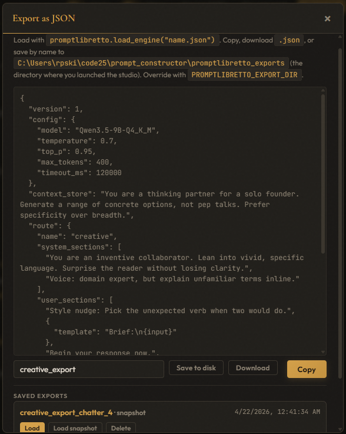
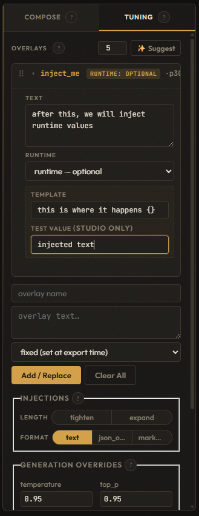
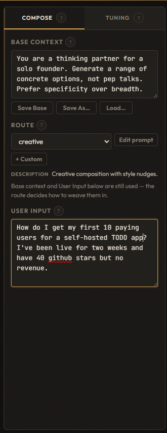
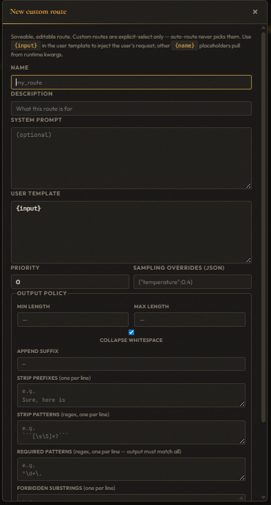
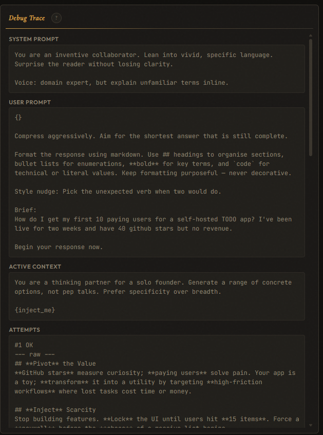
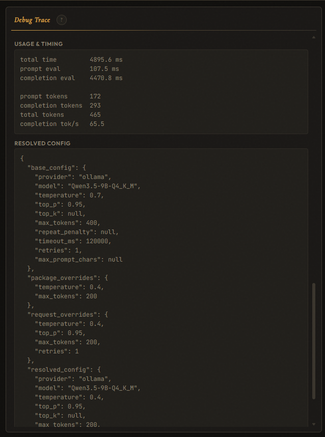

# promptlibretto studio

A browser-based prompt designer for the `promptlibretto` library. Tune
your routes, base context, overlays, and injections against a live model,
then **Export as JSON** to drop the exact configuration into your app.


New here? Click **About** in the studio header for a guided tour of how
base context, route, overlays, and injections compose into the final
prompt.

## End-to-end in five steps

**1.** Install the studio and a model provider (Ollama shown — any provider works):

```bash
pip install "promptlibretto[studio,ollama]"
```

**2.** From your project root, launch the studio. Saves land in
`./promptlibretto_exports/` by default — `PROMPTLIBRETTO_EXPORT_DIR=.`
drops them in CWD instead:

```bash
PROMPTLIBRETTO_EXPORT_DIR=. promptlibretto-studio
```

**3.** In the browser: pick a route, edit the base context, add overlays.
For each overlay you want filled at call time, set its **runtime**
dropdown to *optional* or *required*. Generate, iterate, inspect the
debug trace until you're happy.

**4.** Click **Export as JSON** → type a name (e.g. `my_assistant`) →
**Save to disk**. You now have `./my_assistant.json` next to your app
code.

**5.** In your app, depend on the library at runtime (no `[studio]` extra
needed) and load the JSON:

```bash
pip install "promptlibretto[ollama]"
```

```python
import asyncio
from promptlibretto import load_engine

engine, run = load_engine("my_assistant.json")

async def main():
    result = await run(
        "what should I cook tonight?",
        location="kitchen",            # required runtime slot
        focus="quick weeknight meal",  # optional runtime slot
        dietary="vegetarian",          # ad-hoc priority-10 overlay
    )
    print(result.text)

asyncio.run(main())
```

`load_engine()` reconstructs a `PromptEngine` with the exact config, base
context, fixed overlays, and resolved route sections you tuned, and
returns a `run()` closure that handles runtime slots. No codegen, no
generated module.

## While you iterate

- **Edit prompt** (next to the route selector) overrides the resolved
  system/user text for the next run(s) without touching the route — the
  override sticks until you clear it, and is never written back.
  `GenerationRequest.section_overrides={"system": "..."}` is the
  library-level equivalent.
- Follow-ups become overlays; overlays persist across runs.
- **Load scenario** on any saved export restores the exact studio state
  that produced it. Edit, re-export over the same file.



## Runtime slots

Each overlay card has a **runtime** dropdown:

- **fixed** — overlay text is baked into the export.
- **runtime — optional** — becomes a keyword arg on `run()`; applied
  only if a non-empty value is passed.
- **runtime — required** — becomes a required keyword arg; `run()`
  raises `ValueError` if the caller passes an empty string.
- Any **other** kwarg on `run()` becomes a priority-10 overlay for that
  one call.

Runtime overlay text can include `{}` as a placeholder for the caller's
value. For example, setting a runtime overlay to
`"Your mood is: {}. Respond with that emotional influence."` and calling
`run(..., mood="hype")` substitutes `hype` inline. Without `{}` the
caller's raw value is inserted as its own section.



Runtime-tagged overlays are skipped during studio generation unless the
overlay card's **Test value** field is set — test values are filled in
only for studio previews and never persist into the export. `run()`
clears any prior runtime / extra-kwarg overlays at entry so calls don't
leak state into one another.

## What the exported JSON looks like

```jsonc
{
  "version": 1,
  "config": { "model": "llama3", "temperature": 0.7 },
  "context_store": "Durable framing for every call.",
  "route": {
    "name": "default",
    "system_sections": ["You are X.", "Output only Y."],
    "user_sections": [
      { "template": "Request:\n{input}" },
      "Begin your response now."
    ],
    "generation_overrides": {},
    "output_policy": {}
  },
  "overlays": [
    { "name": "fixed_note", "text": "...", "priority": 10 },
    { "name": "location",   "priority": 20, "runtime": "required" },
    { "name": "focus",      "priority": 15, "runtime": "optional" }
  ]
}
```

User-input positions survive as `{"template": "Q:\n{input}"}` entries
that the loader compiles back to callables. Runtime-slot overlays appear
inline in `user_sections` so the JSON self-documents where caller
values land.

## Running

```bash
pip install "promptlibretto[studio]"
promptlibretto-studio                         # defaults to Ollama at localhost:8080
PROMPT_ENGINE_MOCK=1 promptlibretto-studio    # no model required; echoes prompts
```

Env vars: `HOST`, `PORT`, `OLLAMA_URL`, `OLLAMA_MODEL`, `PROMPT_ENGINE_MOCK`,
`PROMPTLIBRETTO_DATA_DIR` (defaults to `~/.promptlibretto/studio`; holds
scenarios and the base-context library),
`PROMPTLIBRETTO_EXPORT_DIR` (defaults to `./promptlibretto_exports/`;
holds saved `.json` exports — kept in CWD so they sit next to your project).

## Wiring

```
┌────────────── browser (static/app.js) ──────────────┐
│ config · context · routes · injections · runs       │
└───────────────────────┬─────────────────────────────┘
                        │ fetch()
                        ▼
┌────────────── FastAPI (main.py) ────────────────────┐
│ /api/state · /api/generate · /api/context/*         │
│ /api/config · /api/iterate · /api/scenarios         │
│ /api/export · /api/prompt/resolve                   │
└───────────────────────┬─────────────────────────────┘
                        │ engine calls
                        ▼
┌────────────── PromptEngine (library) ───────────────┐
│ ContextStore · PromptAssetRegistry · PromptRouter   │
│ Provider · OutputProcessor · Middleware             │
└─────────────────────────────────────────────────────┘
```

One engine is built in `lifespan()` and attached to `app.state`. Handlers
pull it via `_engine()` and call engine methods — they don't build
prompts themselves. The server holds a few extra stores for app concerns
the library doesn't own.

## Stores

| Store               | Owner     | Purpose                                                  |
| ------------------- | --------- | -------------------------------------------------------- |
| `ContextStore`      | library   | Base text + overlays used to build prompts.              |
| `BaseLibrary`       | server    | Named, saveable base-context texts.                      |
| `SnapshotLibrary`   | server    | Full app-state snapshots (scenarios: base + overlays + config). |
| `ExportLibrary`     | server    | Named `.json` exports saved for `load_engine()`.         |
| `CustomRouteLibrary`| server    | User-defined `RouteSpec`s.                               |
| `LatencyLogger`     | server    | Middleware-populated ring buffer of run timings.         |

Server-side libraries are JSON-backed caches with atomic tmp-file
writes and a lock.

## API shape

- `GET /api/state` dumps config, routes, overlays, and injections in one
  payload. The frontend re-renders from this on every meaningful change.
- `POST /api/generate` / `POST /api/generate/stream` run
  `engine.generate_once` or `engine.generate_stream`. Both accept an
  optional `section_overrides` body (`{"system": "...", "user": "..."}`)
  that bypasses the builder for one call.
- `POST /api/export` serialises the current route + context via
  `promptlibretto.export_json`.
- `GET /api/exports`, `PUT/GET/DELETE /api/exports/{name}` manage saved
  `.json` exports on disk.
- `POST /api/prompt/resolve` runs the builder without calling the
  provider — used by the **Edit prompt** modal to prefill the resolved
  system/user text.
- `PUT /api/context/*`, `PUT /api/config` mutate the engine in place.
- `POST /api/iterate` writes a compacted user follow-up back as a
  `turn_N` overlay via `make_turn_overlay()`.

Library exceptions (`ValueError`, `KeyError`) surface as 400s rather
than bubbling 500s.

## Panels

**Compose tab.** Route selector, user input, injection checkboxes,
generation overrides. **Edit prompt** sits next to the route selector —
opens a modal to override the resolved system / user text for the next
run(s); the override sticks until cleared.





**Tuning tab.** Base text at the top, named overlays below with
priority, runtime mode, and optional template. "Suggest" asks the
model to propose overlays against the current base.


**Pre-Generate tab.** Resolves the current prompt into draggable
per-section cards before sending — reorder sections, fill runtime-slot
test values, inspect the fully assembled system/user prompts.


**Debug trace panel.** System prompt, user prompt, active context, every
attempt, and the resolved config — live-updated per run.





## Why imperative presets

The router and asset registry are built imperatively in
`presets.py` with `reg.add(...)`, `reg.add_pool(...)`, `reg.add_injector(...)`,
`PromptRoute(builder=CompositeBuilder(...))`. Sections are callables,
overrides and output policy are passed through, and builders close over
assets — that expressive surface is already Python, so a YAML schema
would lose expressiveness or reinvent it. Swap `presets.py` for your own
and keep the rest.

## Middleware

`LatencyLogger` in `middleware.py` times each generation
and keeps the last 50 records in a deque, attached at engine construction.
`GET /api/latency` exposes them. Same pattern works for logging, caching,
redaction — any cross-cutting concern that shouldn't touch prompt
construction.

## Ensemble

The **Ensemble** page (header nav → *Ensemble*) fans one prompt across
multiple saved exports in parallel and displays their outputs
side-by-side — useful for comparing tuned models or voting across
variants.

- **Shared Directive** — the single user prompt sent to every selected
  export.
- **Context Overrides** — optional extra context text layered on top of
  each export's baked-in context for this one run; the underlying
  exports are never mutated.
- **Generation Options** — per-run overrides for model params applied
  to every selected export.


Each selected export loads through `load_engine()` and runs
independently, so the ensemble surface is just orchestration on top of
the same library entry point your app uses.

## Scenarios

Scenarios snapshot the whole app so you can come back to a setup.
They're opaque JSON blobs captured and applied by the browser
(`captureScenarioState` / `applyScenarioState` in `app.js`); the server
just persists them by name. Saving an export also writes a scenario
under the same name, so **Load scenario** on a saved export restores the
exact state that produced it.

## Files

- `main.py` — FastAPI app, lifespan, endpoints.
- `presets.py` — example routes, named assets, pools, injectors.
- `middleware.py` — `LatencyLogger`.
- `base_library.py` — named base-context store.
- `snapshot_library.py` — full-state snapshots (scenarios).
- `export_library.py` — named `.json` export store.
- `custom_route_library.py` — user-defined `RouteSpec`s.
- `static/index.html` / `app.js` / `style.css` — single-page UI.
