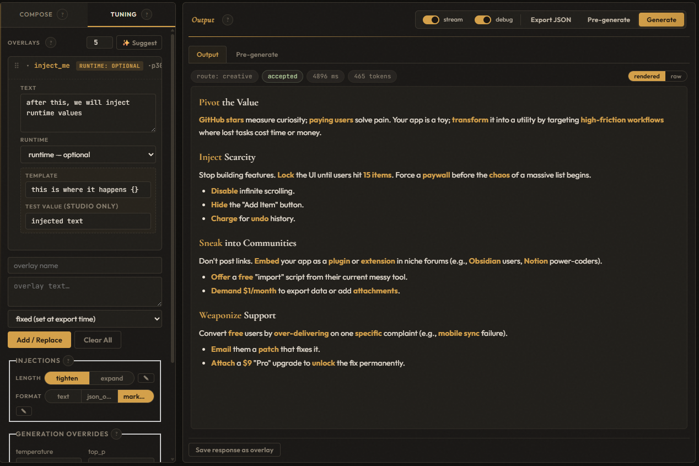
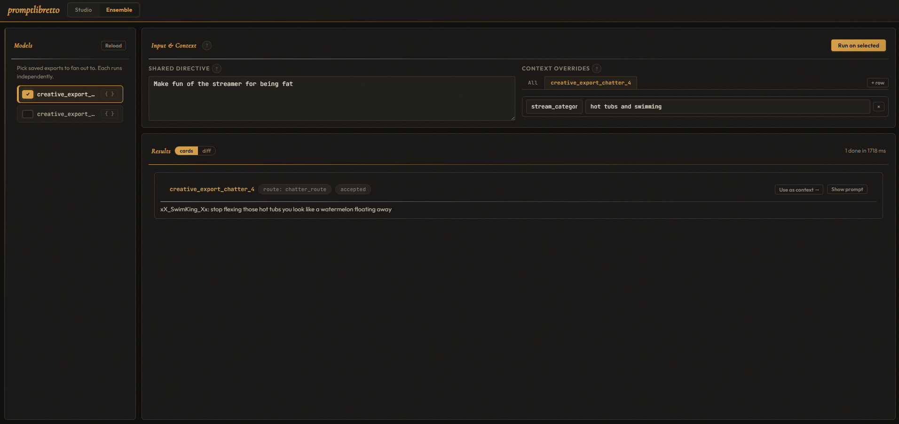
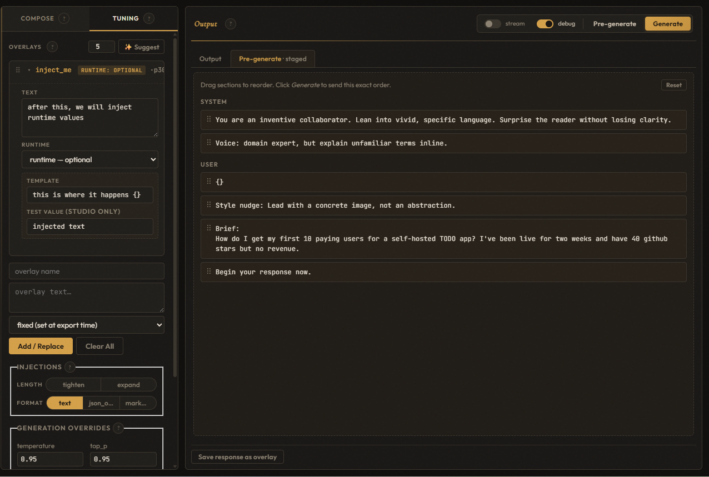

# promptlibretto studio

Browser-based prompt designer for the `promptlibretto` library. Tune
your routes, base context, overlays, and injections against a live
model, then **Export as JSON** to drop the exact configuration into
your app.



Click **About** in the header for a built-in guided tour that walks
through how base context, route, overlays, and injections compose into
the final prompt.

Full walkthrough with screenshots:
**[sockheadrps.github.io/promptlibretto/server](https://sockheadrps.github.io/promptlibretto/server/)**

## Run it

```bash
pip install "promptlibretto[studio]"
promptlibretto-studio                         # defaults to Ollama at localhost:8080
PROMPT_ENGINE_MOCK=1 promptlibretto-studio    # no model required; echoes prompts
```

Env vars: `HOST`, `PORT`, `OLLAMA_URL`, `OLLAMA_MODEL`,
`PROMPT_ENGINE_MOCK`, `PROMPTLIBRETTO_DATA_DIR`
(defaults to `~/.promptlibretto/studio` — scenarios and base-context
library), `PROMPTLIBRETTO_EXPORT_DIR`
(defaults to `./promptlibretto_exports/` — saved `.json` exports, kept
in CWD so they sit next to your project).

## What you do with it

1. Pick a route, fill in a user input, toggle injections and overrides.
2. Generate — inspect the system/user prompts, attempts, and resolved
   config in the debug trace.
3. Iterate. Follow-ups become overlays; overlays persist across runs.
4. **Edit prompt** (next to the route selector) overrides the resolved
   system/user text for the next run(s) without touching the route —
   sticks until cleared.
5. **Export as JSON → Save to disk** under a name. Load it back in your
   app with `promptlibretto.load_engine("name.json")`, which returns
   `(engine, run)`.

Runtime slots: each overlay card has a **runtime** dropdown — *fixed*
bakes the text into the export; *optional* and *required* turn it into
a keyword arg on the loader's `run()` closure. Runtime overlay text
can use `{}` as a placeholder that the caller's value is substituted
into (e.g. template `"Your mood is: {}. Respond with that influence."`
with kwarg `mood="hype"` renders the value inline).

**Ensemble** (header nav → *Ensemble*) fans a single **Shared Directive**
out across multiple saved exports in parallel and shows their outputs
side-by-side. Optional **Context Overrides** layer extra context on top
of each selected export's baked-in state for that one run.



**Pre-Generate** resolves the current prompt into draggable per-section
cards — reorder, fill in runtime-slot test values, and review the fully
assembled system/user prompts before hitting Generate.



## Wiring

```
browser (static/app.js)
   │  fetch()
   ▼
FastAPI (main.py)
   │  engine calls
   ▼
PromptEngine (library)
```

One engine is built in `lifespan()` and attached to `app.state`.
Handlers pull it via `_engine()` and call engine methods — they don't
build prompts themselves. The server holds a couple of extra stores
(base library, scenarios, saved exports, latency middleware) for app
concerns the library shouldn't know about.

## Files

- [`main.py`](main.py) — FastAPI app, lifespan, endpoints.
- [`presets.py`](presets.py) — example routes, named assets, pools, injectors.
- [`middleware.py`](middleware.py) — `LatencyLogger`.
- [`base_library.py`](base_library.py) — named base-context store.
- [`snapshot_library.py`](snapshot_library.py) — full-state snapshots (scenarios).
- [`export_library.py`](export_library.py) — named `.json` export store.
- [`custom_route_library.py`](custom_route_library.py) — user-defined `RouteSpec`s.
- [`static/`](static/) — single-page UI (`index.html`, `app.js`, `style.css`).

Swap `presets.py` for your own and keep the rest — the router and asset
registry are built imperatively there (`reg.add(...)`,
`reg.add_injector(...)`, `PromptRoute(builder=CompositeBuilder(...))`),
which is as expressive as Python.
